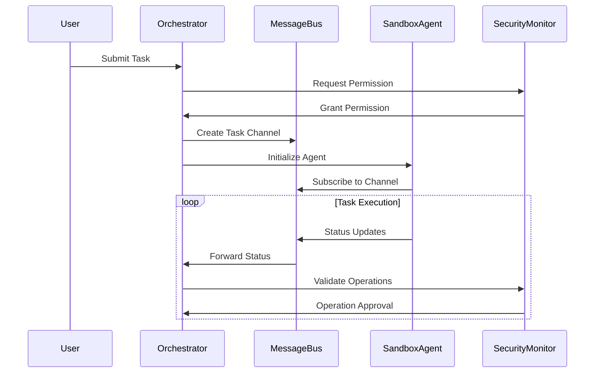

# AI Agent System Specification

## Part 1: Core Architecture and Communication

### 1. System Overview

The system implements a multi-agent AI architecture where a main orchestrator agent coordinates with specialized worker agents running in sandboxed environments. Each agent has specific capabilities and permissions, with all potentially dangerous operations (file system access, web browsing, command execution) occurring in isolated containers.

### 2. Core Components

#### 2.1 Main Orchestrator Agent

- **Purpose**: Coordinates all agent activities and manages system state
- **Location**: Runs in the host application
- **Responsibilities**:
  - Task decomposition and delegation
  - Agent lifecycle management
  - Security policy enforcement
  - State management
  - User interaction

#### 2.2 Worker Agents

- **Types**:
  - Research Agent: Web browsing and information gathering
  - Execution Agent: Running commands and system operations
  - Planning Agent: Task breakdown and project management
  - Analysis Agent: Data processing and synthesis
- **Location**: Each runs in a separate sandbox container
- **Lifecycle**:
  1. Created on-demand
  2. Assigned specific tasks
  3. Terminated after task completion

#### 2.3 Function Registry

- **Purpose**: Manages available functions and their permissions
- **Location**: Distributed across host and containers
- **Components**:
  - Function definitions
  - Permission requirements
  - Resource limits
  - Audit logging

### 3. Communication Architecture

#### 3.1 Inter-Agent Communication Protocol



#### 3.2 Message Bus Specification

```python
class Message(BaseModel):
    id: UUID
    type: MessageType
    sender: AgentID
    receiver: AgentID
    content: Dict[str, Any]
    timestamp: datetime
    security_context: SecurityContext

class MessageBus:
    async def publish(self, channel: str, message: Message):
        pass

    async def subscribe(self, channel: str, callback: Callable):
        pass

    async def request_response(self,
        channel: str,
        message: Message,
        timeout: int
    ) -> Message:
        pass
```

#### 3.3 Communication Patterns

##### 3.3.1 Direct Communication

- Used for simple request-response patterns
- Synchronous operations
- Security-critical operations

```python
# Example: Direct function call with security context
async def execute_command(
    command: str,
    security_context: SecurityContext
) -> CommandResult:
    # Validate security context
    await security_monitor.validate(security_context)

    # Execute in sandbox
    return await sandbox.execute(command)
```

##### 3.3.2 Event-Based Communication

- Used for long-running operations
- Status updates
- Multi-agent coordination

```python
# Example: Event-based task execution
async def handle_task_event(event: TaskEvent):
    match event.type:
        case TaskEventType.STARTED:
            await update_task_status(event.task_id, "running")
        case TaskEventType.COMPLETED:
            await process_task_result(event.task_id, event.result)
        case TaskEventType.ERROR:
            await handle_task_error(event.task_id, event.error)
```

### 4. Security Model

#### 4.1 Trust Boundaries

1. Host Application (Trusted)

   - Orchestrator Agent
   - Security Monitor
   - Configuration Management

2. Sandbox Container (Untrusted)
   - Worker Agents
   - Function Execution
   - File System Access

#### 4.2 Security Contexts

```python
class SecurityContext(BaseModel):
    agent_id: UUID
    permissions: Set[Permission]
    resource_limits: ResourceLimits
    audit_trail: List[AuditEntry]

    def can_execute(self, operation: Operation) -> bool:
        return operation in self.permissions
```

#### 4.3 Permission Management

```python
class PermissionManager:
    async def request_permission(
        self,
        agent: AgentID,
        operation: Operation,
        resources: List[Resource]
    ) -> bool:
        # Check static policies
        if not self.policy_allows(operation):
            return False

        # Request user approval if needed
        if operation.requires_user_approval:
            return await self.request_user_approval(operation)

        return True
```

### 5. State Management

#### 5.1 Distributed State

- Uses Redis for shared state
- Implements CQRS pattern for state updates
- Maintains consistency across containers

```python
class StateManager:
    async def update_state(self,
        key: str,
        value: Any,
        context: SecurityContext
    ):
        # Validate update permission
        if not context.can_modify_state(key):
            raise PermissionError()

        # Apply update
        await self.redis.set(key, value)

        # Broadcast change
        await self.message_bus.publish(
            "state_changes",
            StateChangeEvent(key=key, value=value)
        )
```

#### 5.2 State Synchronization

- Periodic state snapshots
- Event sourcing for state reconstruction
- Conflict resolution strategies

### 6. Error Handling

#### 6.1 Error Categories

1. Security Violations
2. Resource Exhaustion
3. Operation Timeouts
4. Agent Failures
5. Communication Errors

#### 6.2 Recovery Strategies

```python
class ErrorHandler:
    async def handle_error(self, error: SystemError):
        match error:
            case SecurityViolation():
                await self.terminate_agent(error.agent_id)
                await self.notify_security_monitor(error)
            case ResourceExhaustion():
                await self.scale_resources(error.resource_type)
            case OperationTimeout():
                await self.retry_operation(error.operation)
```
