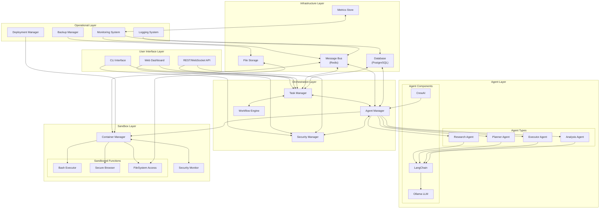

# OVERALL SYSTEM ARCHITECTURE

```mermaid
graph TB
    subgraph "User Interface Layer"
        CLI["CLI Interface"]
        WebUI["Web Dashboard"]
        API["REST/WebSocket API"]
    end

    subgraph "Orchestration Layer"
        TaskMgr["Task Manager"]
        AgentMgr["Agent Manager"]
        SecurityMgr["Security Manager"]
        WorkflowEngine["Workflow Engine"]
    end

    subgraph "Agent Layer"
        subgraph "Agent Types"
            ResearchAgent["Research Agent"]
            PlannerAgent["Planner Agent"]
            ExecutorAgent["Executor Agent"]
            AnalysisAgent["Analysis Agent"]
        end

        subgraph "Agent Components"
            LangChain["LangChain"]
            Ollama["Ollama LLM"]
            CrewAI["CrewAI"]
        end
    end

    subgraph "Sandbox Layer"
        DockerMgr["Container Manager"]
        subgraph "Sandboxed Functions"
            BashExec["Bash Executor"]
            WebBrowser["Secure Browser"]
            FSAccess["FileSystem Access"]
        end
        SecureEnv["Security Monitor"]
    end

    subgraph "Infrastructure Layer"
        MessageBus["Message Bus\n(Redis)"]
        DB["Database\n(PostgreSQL)"]
        Storage["File Storage"]
        Metrics["Metrics Store"]
    end

    subgraph "Operational Layer"
        Monitor["Monitoring System"]
        Logger["Logging System"]
        Backup["Backup Manager"]
        Deploy["Deployment Manager"]
    end

    %% User Interface connections
    CLI & WebUI & API --> TaskMgr
    CLI & WebUI & API --> SecurityMgr

    %% Orchestration Layer connections
    TaskMgr <--> AgentMgr
    TaskMgr <--> WorkflowEngine
    AgentMgr <--> SecurityMgr
    
    %% Agent Layer connections
    AgentMgr --> ResearchAgent & PlannerAgent & ExecutorAgent & AnalysisAgent
    ResearchAgent & PlannerAgent & ExecutorAgent & AnalysisAgent --> LangChain
    LangChain --> Ollama
    CrewAI --> AgentMgr

    %% Sandbox Layer connections
    AgentMgr --> DockerMgr
    DockerMgr --> BashExec & WebBrowser & FSAccess
    DockerMgr <--> SecureEnv

    %% Infrastructure Layer connections
    MessageBus <--> TaskMgr & AgentMgr & DockerMgr
    DB <--> TaskMgr & AgentMgr
    Storage <--> FSAccess
    Metrics <--> Monitor

    %% Operational Layer connections
    Monitor --> MessageBus & DB
    Logger --> MessageBus
    Backup --> Storage
    Deploy --> DockerMgr
```